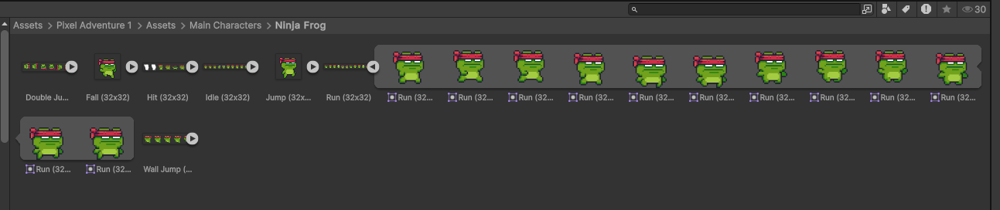

# Laboratorium 2

Temat: Animacje w Unity

Cel: Poznanie technik tworzenia animacji w grach 2D oraz triggery

Tabela zawartości
---
- [Laboratorium 2](#laboratorium-2)
  - [Tabela zawartości](#tabela-zawartości)
  - [W ramach zajęć](#w-ramach-zajęć)
  - [Edytowanie sprite'ów](#edytowanie-spriteów)
  - [Animacje](#animacje)
    - [Animacje z wykorzystaniem systemu animacji](#animacje-z-wykorzystaniem-systemu-animacji)
      - [Tworzenie animacji](#tworzenie-animacji)
      - [Maszyna stanowa animacji](#maszyna-stanowa-animacji)
    - [Animacje z wykorzystaniem kodu](#animacje-z-wykorzystaniem-kodu)
  - [Fizyka - Triggery](#fizyka---triggery)

## W ramach zajęć

Należy zapoznać się z treścią konspektu, a następnie przystąpić do wykonywania zadań. \
Na koniec zajęć proszę o wypełnienie [ankiety](https://docs.google.com/forms/d/e/1FAIpQLSenLGX8JVObhISm4gXoly_Q_2hqAH5OkoDweszK-Uf6Nq_RDg/viewform?usp=dialog) `:)`

<details>
<summary>Na ocenę 3</summary>

  - utworzyć animację chodzenia
    - animacja jest odtwarzana gdy postać jest w ruchu, i zatrzymywana wraz z zatrzymaniem postaci

</details>

<details>
<summary>Na ocenę 4</summary>
zadanie na 3, i dodatkowo:

- dodać do sceny obiekt, po wejściu w który aktywuje się animacja dowolnego innego
obiektu na scenie
  - animacja może być dowolna, np. obracanie się

</details>

<details>
<summary>Na ocenę 5</summary>
zadanie na 4, i dodatkowo:

- dodać do sceny obiekty zbieralne, które będą nam dodawać i odbierać punkty
  - dodać obiekty, które będą dodawać różne ilości punktów, np. 1 i 2
  - dodać obiekty, które będą odbierać losową ilość punktów, np. z zakresu 1 do 3
  - obiekty powinny znikać ze sceny po zebraniu
  - ilość punktów po zmianie powinna pojawiać się w konsoli
  - obiekty zbieralne powinny mieć dowolną animację, np. kręcenie się, unoszenie

Rady:
  - Aby logować do konsoli, wystarczy wykorzystać metodę `Debug.Log()` ([dokumentacja](https://docs.unity3d.com/6000.0/Documentation/ScriptReference/Debug.Log.html))
  - Do usuwania obiektów można wykorzystać metodę `GameObject.SetActive(false)` ([dokumentacja](https://docs.unity3d.com/6000.0/Documentation/ScriptReference/GameObject.SetActive.html)) lub `Object.Destroy()` ([dokumentacja](https://docs.unity3d.com/6000.0/Documentation/ScriptReference/Object.Destroy.html))
  - Aby obiekty można było 'dotknąć', najłatwiej będzie użyć do tego koliderów (triggerów)

</details>


## Edytowanie sprite'ów

W celu wykorzystania sprite'ów do animacji, może być potrzebne ręczne podzielenie jednej, dużej tekstury, na poszczególne klatki animacji.

W tym celu należy otworzyć okienko `Sprite Editor`, dostępne poprzez rozwijane menu u góry: `Window -> 2D -> Sprite Editor`

https://github.com/user-attachments/assets/6920cd9b-2ff3-42a3-88a7-b735ec99cac3

Po wybraniu odpowiedniej tekstury w projekcie, należy upewnić się, że został wybrany odpowiedni `Sprite Mode`. Wartość tą można ustawić w inspektorze po kliknięciu na odpowiedni plik w projekcie. Należy ustawić go na `Multiple`.

https://github.com/user-attachments/assets/6b148387-b3a9-4909-b303-8f5102619048

Jeśli tekstura nie została odpowiednio podzielona automatycznie, można zrobić to ręcznie. Wystarczy kliknąć, i rozciągnąć prostokąt na zamierzony fragment obrazu.

https://github.com/user-attachments/assets/f8e858f1-26d4-4992-a718-f5e42e3a279a

Istnieje również możliwość automatycznego podzielenia sprite'ów, przydatna zwłaszcza, jeśli poszczególne elementy leżą na jednorodnej siatce, tak jak w tym przypadku. W tym celu należy rozwinąć opcję `slice` u góry okienka, i ustawić parametry w zależności od potrzeby.

https://github.com/user-attachments/assets/c2a3358b-49ea-4f4e-acf4-2de6334d65d4

Po wszystkim, należy zastosować swoje zmiany.

https://github.com/user-attachments/assets/46b1985d-4f8e-42d1-ab73-fe78ce1df895

W strukturze folderu, powinno dać się "rozwinąć" teksturę, po czym widoczny powinien być zbiór sprite'ów wycięty z niej.



## Animacje

Animacje można wykonać na dwa sposoby - używając systemu animacji, jaki ma silnik, lub samemu programując odpowiednie zachowania na obiektach.

### Animacje z wykorzystaniem systemu animacji

System animacji w Unity opiera się na Animatorze, który wykorzystuje Mecanim – wbudowany system zarządzania animacjami. Kluczowym elementem jest `Animator Controller`, który definiuje przejścia między animacjami i określa ich logikę, np. zmiany w zależności od parametrów (bool, float, int, trigger).

Animacje mogą być tworzone w Animatorze (np. przez keyframe’y) lub importowane (np. z Blendera czy innych programów). Każda animacja przypisana do obiektu to Animation Clip, a Unity interpoluje ruchy między klatkami. Można też korzystać z blend trees (do płynnych przejść) i IK (Inverse Kinematics) do dynamicznego ruchu postaci.

Animacje mogą być sterowane przez skrypty w C# za pomocą Animator API, co pozwala na programowe wyzwalanie stanów i dostosowanie animacji do interakcji w grze.

#### Tworzenie animacji

Za pomocą okna `Animation` (`Window -> Animation -> Animation`), można tworzyć animacje oparte o keyframe'y. Poniżej nagranie video, przedstawiające jak za pomocą trybu 'nagrywania', można szybko zapisać stany pośrednie obiektu, oraz modyfikować animacje, przestawiając krzywe.

https://github.com/user-attachments/assets/7afa2737-63ea-431e-8e5c-1e7705ceefd3

W przypadku animacji opartej o sprite'y, wartością modyfikowaną przez aplikację będzie właściwość `Sprite` na komponencie `Sprite Renderer`.

Można szybko utworzyć animację, poprzez przeciągnięcie jednocześnie zaznaczonych sprite'ów na odpowiedni obiekt, tak, jak zaprezentowano na video poniżej.

https://github.com/user-attachments/assets/295ba515-855f-41c5-b588-04bf71af22fb

W razie potrzeby, tego typu animację można również utworzyć ręcznie.

https://github.com/user-attachments/assets/10a2fabc-ab6e-40aa-b2ac-e3cece1ccb89

Utworzona i zapisana animacja zostaje zasobem w strukturze projektu. Należy zwrócić uwagę na właściwości tego zasobu, po kliknięciu w widoku projektu:


Właściość `Loop Time` odpowiada za zapętlenie animacji. `Cycle Offset` oznacza od której klatki animacja powinna zostać zapętlona.

#### Maszyna stanowa animacji

Jak można zauważyć, obiekt, na którym została dodana animacja, został automatycznie uzupełniony o komponent `Animator`.


Klikając dwukrotnie na wartość właściwości `Controller` tego componentu, lub otwierając poprzez menu (`Window -> Animation -> Animator`), można otworzyć okno edytora, pozwalające na edycję obiektu typu `Animator Controller`.


Okno prezentuje maszynę stanową, w której stany mogą odpowiadać animacjom, a między nimi prowadzą przejścia, które następują w zależności od spełnionych warunków.

W tym momencie można zobaczyć cztery elementy:

  - Any State - każde z przejść z tego elementu może być ewaluowane niezależnie od tego, jaki jest aktualny stan
  - Entry - stan początkowy maszyny stanów
  - Exit - pozwala na wyjście z maszyny stanów, potencjalnie przydatne, gdy kilka maszyn stanów jest w sobie zagnieżdżone
  - 'Nasza Animacja' ręcznie dodany element, reprezentujący stan odtwarzający wcześniej przygotowaną animację

Typowo, jak dla maszyny stanowej, przejścia zachodzą jedynie, gdy ich warunki zostają spełnione. Oznacza do, że nie zachodzą zmiany, jeśli nie ma przejść "wyjściowych" ze stanu, lub gdy element 'Any State' nie ma żadnych przejść. Warto zwrócić na to uwagę.

Maszynę stanów można rozbudować, aby postać mogła wykonywać dwie różne animacje.

W poniższym video kolejno:
1. Podpięto komponent `Animator` do skryptu, który ma sterować animacją (kod źródłowy poniżej)
2. Dodano parametr 'run', który ma kontrolować przejście między stanami
3. Dodano dwie animacje do maszyny stanów
4. Dodano między nimi przejścia, uwarunkowane wartością parametru 'run'

https://github.com/user-attachments/assets/bfa351e7-0012-4403-9729-4a30036b7d0f

```c#
using UnityEngine;

public class AnimationScript : MonoBehaviour
{
    [SerializeField]
    private Animator _anim;

    void Update()
    {
        if (Input.GetKey(KeyCode.F))
        {
            _anim.SetBool("run", true);
        }
        else
        {
            _anim.SetBool("run", false);
        }
    }
}
```

⚠️ Dodatkowo: we właściwościach przejścia istnieje `HasExitTime`. Jeśli opcja ta jest zaznaczona, animacja aktualnego stanu zostanie odtworzona w całości, przed wykonaniem przejścia. W przypadku animacji postaci gracza może wyglądać to jak błąd lub niepotrzebne opóźnienie, dlatego warto jest ją wyłączyć.


### Animacje z wykorzystaniem kodu

Alternatywą dla systemu animacji jest ich programowanie. Może być to sensowniejsze rozwiązanie w niektórych przypadkach.

Poniższy kod jest przykładem takiej animacji. W tym przypadku, należy umieścić jeden obiekt w hierarchii wewnątrz drugiego. Dzięki temu kod, ustawiając właściwości `localPosition` oraz `localRotation`, ustawia te wartości względem rodzica w hierarchii, zamiast globalnego układu odniesienia. Dzięki temu, zmieniając pozycję rodzica, animowany obiekt również będzie zmieniał swoją pozycję.

https://github.com/user-attachments/assets/6382943e-5101-4e64-a7fc-620997ebceb0


```c#
using System;
using UnityEngine;

public class AnimationScript : MonoBehaviour
{
    void Update()
    {
        var x = (float)Math.Sin(7 * Time.timeAsDouble);
        var y = (float)Math.Sin(8 * Time.timeAsDouble);
        var r = (float)Math.Sin(2 * Math.PI * Time.timeAsDouble * 0.1) * 4;

        transform.localPosition = new Vector3(x, y, 0);
        transform.localRotation = Quaternion.Euler(0, 0, 360 * r);
    }
}
```


## Fizyka - Triggery

Triggery to specjalny tryb działania koliderów (Colliders), które wykrywają obiekty w swoim zasięgu, ale nie powodują fizycznych kolizji. Są używane do wykrywania wejścia, wyjścia i przebywania obiektów w danym obszarze.

Każdy kolider (np. `BoxCollider`, `SphereCollider`) ma właściwość `Is Trigger` – po jej zaznaczeniu collider przestaje wchodzić w fizyczne interakcje z innymi obiektami, ale nadal wykrywa ich obecność.

Przykłady użycia triggerów:

  - strefy wykrywania (np. AI wykrywa gracza, aktywacja pułapki)
  - obszary zbierania przedmiotów (np. gracz wchodzi w trigger i podnosi przedmiot)
  - przejścia między poziomami (np. wejście do nowego obszaru)
  - mechaniki interaktywne (np. otwieranie drzwi, gdy gracz podejdzie blisko)

Warto również zwrócić uwagę na tzw. 'warstwy' ([dokumentacja](https://docs.unity3d.com/Manual/LayerBasedCollision.html)). Po ich odpowiednim ustawieniu, można ograniczyć wykrywanie kolizji, oraz wejść i wyjść triggerów, aby tylko określone obiekty mogły aktywować dalszą logikę. Innym sposobem na to jest sprawdzanie przypiętego tagu na kolidującym obiekcie, lub szukanie określonego komponentu na obiekcie, z którym wykryta została interacja. 

https://github.com/user-attachments/assets/74734a8f-3dc3-4401-b29d-21e17cbe53af

**⚠️ Uwaga: Aby poniższe metody mogły być wywołane, przynajmniej jeden z obiektów z koliderami musi również mieć komponent `Rigidbody2D`! \
Aby uniknąć działania fizycznych sił na obiekt, należy ustawić właściwość `Kinematic` na `true`.**

konfiguracja triggera:


konfiguracja kolidera:


kod:

```c#
using UnityEngine;

public class TriggerScript : MonoBehaviour
{
    [SerializeField]
    private SpriteRenderer _spriteRenderer;

    private void Start()
    {
        _spriteRenderer.color = Color.white;
    }

    private void OnTriggerEnter2D(Collider2D other)
    {
        _spriteRenderer.color = Color.red;
        Debug.Log("OnTriggerEnter2D " + other.name);
    }

    private void OnTriggerExit2D(Collider2D other)
    {
        _spriteRenderer.color = Color.white;
        Debug.Log("OnTriggerExit2D " + other.name);
    }

    // metoda jest wykonywana w ramach symulacji fizycznej (pętla FixedUpdate), więc będzie wykonywana mniej razy w ciągu sekundy niż kod związany z klatkami (Update)
    private void OnTriggerStay2D(Collider2D other)
    {
        Debug.Log("OnTriggerStay2D " + other.name);
    }
}
```
