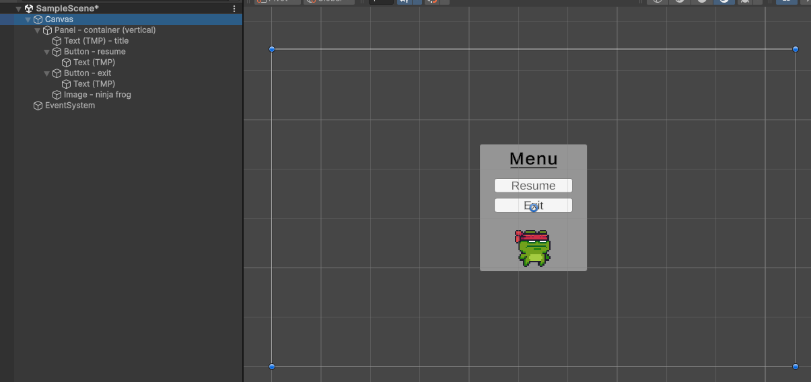
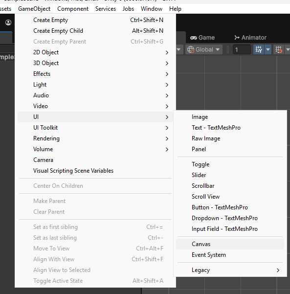
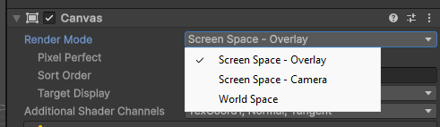
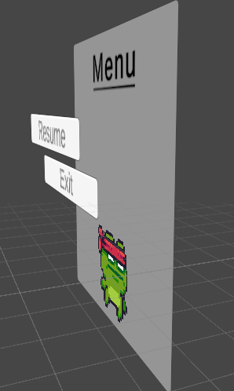
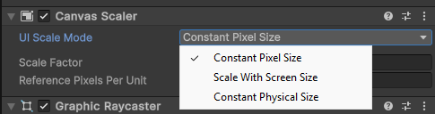
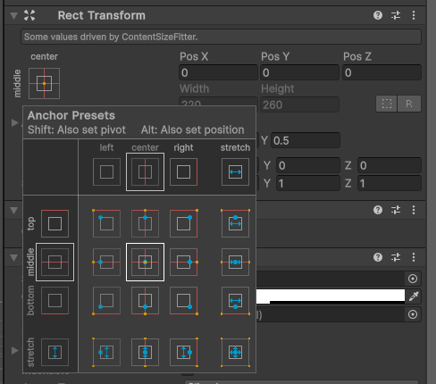
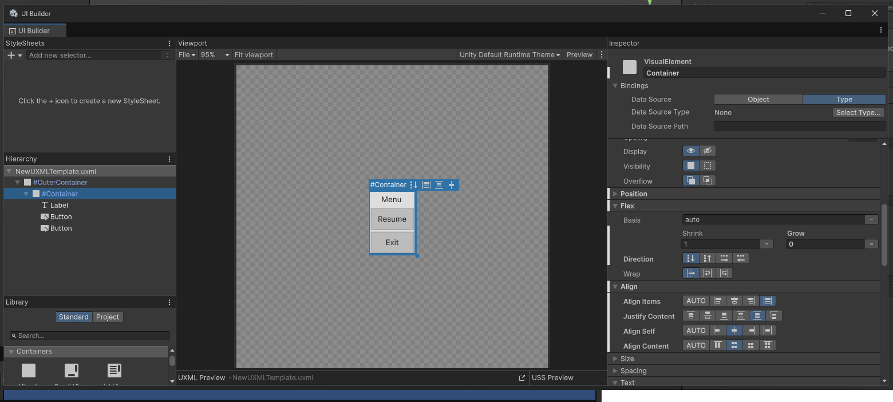
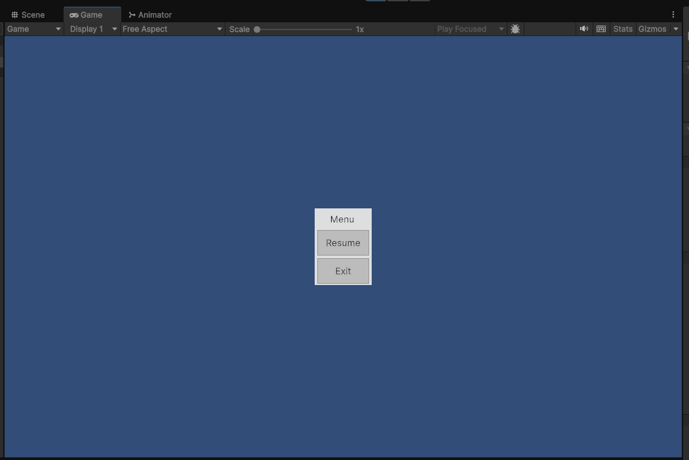
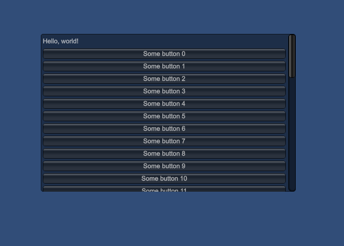

# Laboratorium 3

Temat: Interfejs użytkownika; instancjonowanie obiektów

Cel: Poznanie sposobów tworzenia UI w Unity; instancjonowanie obiektów

Tabela zawartości
---
- [Laboratorium 3](#laboratorium-3)
  - [Tabela zawartości](#tabela-zawartości)
  - [W ramach zajęć](#w-ramach-zajęć)
  - [Interfejs użytkownika](#interfejs-użytkownika)
    - [uGUI](#ugui)
      - [Canvas](#canvas)
      - [Układ elementów](#układ-elementów)
      - [Elementy interaktywne](#elementy-interaktywne)
      - [Tekst](#tekst)
    - [UI Toolkit](#ui-toolkit)
    - [IMGUI](#imgui)
  - [Instancjonowanie obiektów](#instancjonowanie-obiektów)

## W ramach zajęć

Należy zapoznać się z treścią konspektu, a następnie przystąpić do wykonywania zadań. \
Na koniec zajęć proszę o wypełnienie [ankiety](https://docs.google.com/forms/d/e/1FAIpQLSeZQbkMnHsM1G2tigVtVs5YseKOfLsbMDBLig7av9paLzFoLg/viewform?usp=dialog) (nowe materiały, nowy link) `:)`

<details>
<summary>Na ocenę 3</summary>

- wykorzystując funkcję logowania ilości zebranych przez gracza punktów, wyświetlać liczbę punktów w interfejsie użytkownika (nie korzystając z *IMGUI*)

</details>

<details>
<summary>Na ocenę 4</summary>
zadanie na 3, i dodatkowo:

- utworzyć proste menu zawierające kilka przycisków, na przykład:
  - przycisk wychodzenia z gry
  - przyciski z ustawieniami
  - przycisk do zamknięcia menu
- dodać przycisk otwierania menu, gdy jest zamknięte

Rady:
- w celu wyjścia z gry można wykorzystać poniższy kod:
  ```csharp
  // na górze skryptu
  #if UNITY_EDITOR
  using UnityEditor;
  #endif

  // niżej, w odpowiedniej metodzie
  #if UNITY_EDITOR
  // wyjście z trybu 'gry' w edytorze, bo Application.Quit() nie działa :/
  EditorApplication.ExitPlaymode();
  #else
  // chyba że uruchomiony jest build gry
  Application.Quit();
  #endif
  ```
- aby elementy interfejsu pojawiały się i znikały, można wykorzystać metodę `gameObject.SetActive(true/false)`, tak jak na poprzednich zajęciach

</details>

<details>
<summary>Na ocenę 5</summary>

zadanie na 4, i dodatkowo:
- utworzyć trigger, który po aktywacji wywołuje odpowiednią funkcję:
  - wybiera jeden z kilku dostępnych obiektów do instancjonowania
  - instancjuje obiekt kilka razy na scenie
  - pozycja instancjonowanych obiektów jest parametryczna, dynamiczna (zależna od czegoś innego), lub losowa
- instancjonowane obiekty powinny znikać po wejściu w nie/zebraniu ich (mogą to być np. obiekty przygotowane w ramach poprzednich zajęć)


Rady:
- aby mieć listę, do której można dodawać obiekty, wystarczy dodać pole `public List<GameObject> Objects;` (lub, bardziej 'poprawnie': `[SerializeField] private List<GameObject> Objects;`)
- pozycję można oskryptować tak, aby losować 5 elementów (bez powtórzeń) ze zbioru wektorów lub obiektów typu `Transform`, a następnie przypisać ich pozycje do pozycji instancjonowanych obiektów

</details>

## Interfejs użytkownika

Silnik Unity posiada kilka niezależnie działających systemów interfejsu użytkownika. Każdy z nich działa inaczej, i nadaje się do innych zastosowań. W ramach zajęć należy skupić się na systemie uGUI, pozostałe natomiast zostały wspomniane jako ciekawostka, i jednocześnie potencjalnie przydatna informacja do pracy nad projektem.

W pierwszej kolejności został przedstawiony system *uGUI*, oparty na hierarchii obiektów. Jest relatywnie prosty i powinien być użyty w ramach niniejszych zajęć.

Kolejny, *UI Toolkit*, to najnowszy system, inspirowany współczesnym programowaniem front-end. Jest aktualnie preferowanym systemem do tworzenia nowych kontrolek dla samego edytora.

Ostatni, *IMGUI*, to najstarszy system, dziś najczęściej używany do bardzo szybkiego prototypowania, wcześniej również do budowania interfejsu edytora Unity. Nie zaleca się używania go, warto jednak wspomnieć o tym, w jaki sposób działa.

### uGUI

Jest to system oparty na hierarchii obiektów. Wykorzystując system wspólny ze sceną, pozwala na tworzenie interfejsu w oparciu o relatywnie prosty system typu przeciągnij-i-upuść. Każdy obiekt budujący interfejs, tak samo jak inne obiekty, ma swoje komponenty, może mieć przypisane skrypty, zachowania, właściwości, animacje.




#### Canvas

Kluczowym komponentem jest *Canvas*. Zarządza on renderowaniem interfejsu, na który składa się każdy obiekt poniżej w hierarchii. Wiele komponentów tego typu może być wewnątrz siebie zagnieżdżonych. Każdy z nich będzie odpowiadał za renderowanie swoich elementów, co oznacza, że jeśli nie będą zachodziły na nich żadne zmiany, to nie będą one re-renderowane. Dzięki temu dynamicznie zmieniające się elementy interfejsu nie będą powodować niepotrzebnego zużycia GPU, ponieważ statyczne elementy nie muszą być ponownie renderowane.

Aby dodać obiekt z komponentem *Canvas*, należy opcję z rozwijanego menu: `GameObject->UI->Canvas`.






Jego ważną własnością jest możliwość wyboru trybu renderowania. Interfejs może być renderowany bezpośrednio na ekran, dzięki czemu będzie on "nad" wszystkim innym; może być też renderowany na określonej kamerze, co ma swoje użycie w przypadku złożonych systemów renderowania. Ostatnia opcja pozwala renderować interfejs w przestrzeni świata. Dzięki temu zachowuje się on jak trójwymiarowy obiekt. Warto zauważyć, że w takiej konfiguracji elementy mogą potencjalnie znajdować się na różnych płaszczyznach, jednak to, w jaki sposób są renderowane, oznacza, że nie będą sortowane względem głębi. W takiej sytuacji należy wykorzystać wiele niezależnych hierarchii z elementami UI.



Jednym z kluczowych komponentów związanych z *Canvas* jest *Canvas Scaler*. Odpowiada on za tryb skalowania zawartości - właściwość `UI Scale Mode`. Interfejs może być skalowany względem fizycznego rozmiaru ekranu, i dalej, bardziej względem szerokości lub wysokości; może mieć stały rozmiar fizyczny, tzn. na ekranach o różnych rozmiarach, interfejs będzie próbował zachować stałe DPI; oraz opcja `Constant Pixel Size`, oznaczająca, że wszystkie wymiary zdefiniowane w pikselach będą zachowane między ekranami, bez dodatkowych zmian.



#### Układ elementów

Elementy interfejsu mają komponent `Rect Transform` zamiast `Transform`, z dodatkowymi kontrolkami pozwalającymi na szybsze budowanie interfejsu.



Przycisk w lewym górnym rogu inspektora pozwala na szybsze układanie elementów względem rodzica w hierarchii. Sposób, w jaki to działa, przedstawiono na filmiku poniżej.

https://github.com/user-attachments/assets/353f573a-06f5-48dd-bf50-21d172d7c0bf

`Pivot` określa punkt, względem którego określone są transformacje. Modyfikując odpowiednio `Anchor points` można zmienić względem jakich punktów ustalana jest pozycja i skalowanie.

Korzystając z komponentów `Content Size Fitter` oraz `* Layout Group` można uzyskać automatyczne układanie się elementów wewnątrz innych elementów UI, co przedstawiono na filmiku poniżej.

https://github.com/user-attachments/assets/e5a5d25e-9dc2-4f8d-9f40-8176f929782e

#### Elementy interaktywne

Elementy które można przesuwać, edytować, lub klikać i aktywować, mogą mieć możliwość wykonywania akcji. Pozwala to na ustawianie **właściwości**, lub wykonywanie metod. Poniższe nagranie pokazuje jak ustawić przycisk, by wykonywał odpowiednią metodę:

https://github.com/user-attachments/assets/1ca54d5c-fcca-4c34-8e90-67b228c82533

```csharp
using UnityEngine;

public class SomeScript : MonoBehaviour
{
    public int SomeField;

    public int SomeProperty { get; set; }

    public void SomeMethod(string someArgument)
    {
        Debug.Log(someArgument);
    }
}
```

**⚠️ Uwaga: `SomeProperty` to właściwość, a `SomeField` to pole. Właściwości są widoczne na interfejsie akcji przycisku, a pola nie.**

Inne elementy interaktywne działają na podobnej zasadzie.

#### Tekst

Unity ma paczkę do renderowania tekstu, `TextMeshPro`. Jest ona również używana w przypadku uGUI. Oznacza to, że część funkcjonalności może wydawać się zduplikowana. Istnieją równolegle dwa rodzaje takiego elementu:

- TextMeshPro - w przypadku niezależnego obiektu istniejącego w przestrzeni gry
- TextMeshProUGUI - w przypadku elementu należącego do hierarchii obiektów w ramach UI

Cały czas dostępne są 'stare' (legacy) wersje, jednak są one jakościowo gorsze, oraz nie dają porównywalnych ustawień wyświetlania tekstu.

Paczka `TextMeshPro` wspiera tzw. [rich text](https://docs.unity3d.com/Packages/com.unity.textmeshpro@4.0/manual/RichTextSupportedTags.html), czyli wykorzystanie odpowiednich tagów w tekście jako metodę formatowania tekstu, co może być potencjalnie przydatne.

Wartość tekstu można ustawić jako wartość publicznej właściwości na komponencie.

### UI Toolkit

UI Toolkit w Unity to nowoczesny framework do tworzenia interfejsów użytkownika, który zastępuje starsze systemy UI. Jest oparty na strukturze podobnej do technologii webowych, co oznacza, że interfejsy buduje się za pomocą:

- UXML (odpowiednik HTML)
- USS (odpowiednik CSS)
- C#

Na dzień tworzenia niniejszego dokumentu UI Toolkit nie jest jeszcze pełnym zamiennikiem systemu uGUI. Brakuje rzeczy takich jak wyświetlanie w przestrzeni gry (aktualnie dostępne w ramach publicznych testów/eksperymentalnej funkcjonalności), jednak sprawdza się świetnie do tworzenia interfejsów programów i narzędzi na silniku Unity.

System układania elementów oparty jest na algorytmie analogicznym do systemu `flex` dla HTML5. Pozwala to na szybkie tworzenie elementów o dynamicznej zawartości i rozmiarach.





Poniżej XML reprezentujący wyświetlane okienko.

```xml
<ui:UXML xmlns:ui="UnityEngine.UIElements" xmlns:uie="UnityEditor.UIElements" editor-extension-mode="False">
    <ui:VisualElement name="OuterContainer" style="flex-grow: 1; flex-direction: column; justify-content: space-around;">
        <ui:VisualElement name="Container" style="flex-grow: 0; top: auto; left: auto; flex-direction: column; justify-content: space-around; align-items: stretch; align-self: center; align-content: center; background-color: rgba(238, 238, 238, 0.84);">
            <ui:Label text="Menu" style="-unity-text-align: upper-center;" />
            <ui:Button text="Resume" enable-rich-text="true" style="flex-grow: 1;" />
            <ui:Button text="Exit" style="flex-grow: 1; align-self: auto;" />
        </ui:VisualElement>
    </ui:VisualElement>
</ui:UXML>
```

Dodatkowo istnieje możliwość tworzenia w taki sam, deklaratywny sposób kontrolek i innych elementów interfejsu. Dzięki temu, w jaki sposób system działa, o wiele łatwiej mieć kontrolę nad strukturą i organizacją kodu, co jest bardzo dużą zaletą względem pozostałych systemów.

Jeśli rozwiązania webowe są lepiej znane, a ewentualne braki w funkcjonalności nie są przeszkodą, warto rozważyć użycie tego systemu w ramach swojego projektu.

### IMGUI

 Pierwsze dwie litery skrótu pochodzą od *immediate mode*, co oznacza, że każdy z elementów interfejsu ma odpowiadającą metodę (lub funkcję rozpoczynającą i kończącą w przypadku "kontenerów") wywoływaną w odpowiedniej kolejności, co może przypominać działanie starego API OpenGL. Jest to bardzo niewydajne, ponieważ każdy element jest renderowany po kolei, i musi być renderowany w każdej klatce, potencjalnie również przeliczając układ tych elementów. W dwóch pozostałych trybach interfejs nie jest ponownie renderowany, jeśli nie nastąpiły jakiekolwiek zmiany.

 Klasyczny, domyślny wygląd kontrolek może wywoływać uczucia nostalgii związanej ze starymi grami online, uruchamianymi jeszcze przez wtyczkę przeglądarkową.



Kod odpowiadający powyższemu widokowi:

 ```csharp
public Vector2 scrollPos;

private void OnGUI()
{
    var rect = new Rect(Screen.width / 4, Screen.height / 4, Screen.width / 2, Screeheight / 2);
    GUI.Box(rect, GUIContent.none);
    GUILayout.BeginArea(rect)
    scrollPos = GUILayout.BeginScrollView(scrollPos)
    GUILayout.BeginVertical()
    GUILayout.Label("Hello, world!");
    for (int i = 0; i < 50; i++)
    {
        if (GUILayout.Button($"Some button {i}"))
        {
            Debug.Log($"Przycisk {i} został wciśnięty!");
        }
    }
    GUILayout.EndVertical()
    GUILayout.EndScrollView()
    GUILayout.EndArea();
}
```

Należy zwrócić uwagę na metody typu `Begin-` i `End-`. Każda z metod musi być wywołana w odpowiedniej kolejności.

Choć pozornie wydaje się, że system ten powinien umożliwiać szybkie prototypowanie, jednak konieczność kompilacji znacząco je wydłuża. Dodatkowo osiąganie bardziej skomplikowanych układów, lub estetyczne dopracowanie istniejącego interfejsu może być tym trudniejsze.

## Instancjonowanie obiektów

Na silniku Unity istnieje pojęcie 'prefabu', tzn. obiektu wcześniej przygotowanego, który może zostać później wykorzystany. Jest to rodzaj zasobu (assetu), który można zapisać, a później współdzielić między wieloma scenami, lub używać wielu jego kopii (instancji) w ramach jednej sceny.

Aby taki zasób utworzyć, wystarczy przeciągnąć obiekt ze sceny (okienka hierarchii) do okna z plikami, w wyniku czego obiekt, w tym wszystkie jego komponenty, ich stan, oraz cała hierarchia obiektów-dzieci, zostaną zserializowane. Od tego momentu również obiekt na scenie zostanie powiązany z prefabem. Podobnie również kopie po przeciągnięciu zasobu na scenę również będą powiązane z oryginałem. Powiązanie to oznacza, że zmiany na zasobie (prefabie) będą również zachodziły na jego instancjach. Nie działa to w drugą stronę - obiekty istniejące na scenie mogą być modyfikowane, i nie będzie miało to wpływu na inne powiązane instancje ani na oryginał.

Metoda `Instantiate()` posiada [kilka przeciążeń](https://docs.unity3d.com/6000.0/Documentation/ScriptReference/Object.Instantiate.html) w zależności od potrzeby. Zasadniczą ideą jest utworzenie kopii obiektu, opcjonalnie o określonej pozycji, rotacji lub o określonym rodzicu w hierarchii.

W najprostszym przypadku, poniższy kod utworzy nową infrancję przypisanego obiektu.

```csharp
public GameObject prefab;

void Start()
{
    var instance = Instantiate(prefab);
}
```

ℹ️ Warto wiedzieć: metoda `Instantiate` wcale nie musi działać na prefabach. Można wybrać dowolny inny obiekt na scenie. W wyniku wykonania tej metody zostanie utworzona głęboka kopia wszystkich komponentów, skryptów i hierarchii, efektywnie tworząc idealnego klona.

ℹ️ Warto wiedzieć: metoda ta również przyjmuje argument typu 'kwaternion'. To dość nieintuicyjna struktura, reprezentująca rotację obiektu w przestrzeni trójwymiarowej. Statyczna metoda `Quaternion.Euler(x, y, z)` może pozwolić na wykorzystanie trzech znajomych składników rotacji w znacznej większości sytuacji. Kolejną przydatną metodą jest `Quaternion.LookRotation(A, B)`, pozwalająca na stworzenie rotacji skierowanej w danym kierunku, z uwzględnieniem kierunku "w górę". Dobrze jest jednak zaznajomić się z tą konstrukcją matematyczną.
