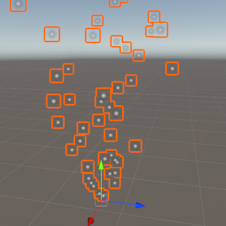
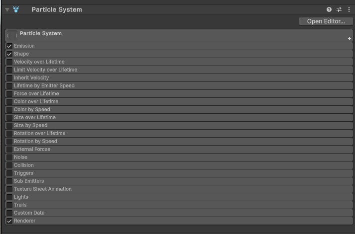
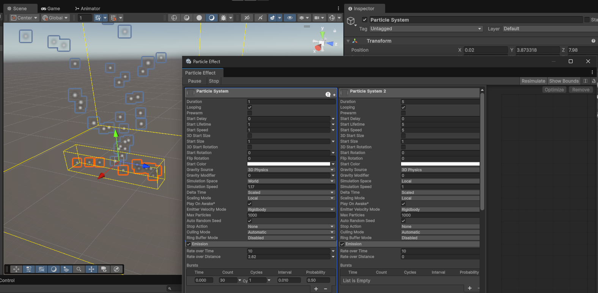

# Laboratorium 4

Temat: Systemy cząsteczek; współprogramy

Cel: Poznanie komponentu systemu cząsteczek; pisanie współprogramów

Tabela zawartości
---
- [Laboratorium 4](#laboratorium-4)
  - [Tabela zawartości](#tabela-zawartości)
  - [W ramach zajęć](#w-ramach-zajęć)
  - [Efekty Cząsteczkowe](#efekty-cząsteczkowe)
  - [Współprogramy (coroutine)](#współprogramy-coroutine)

## W ramach zajęć

Należy zapoznać się z treścią konspektu, a następnie przystąpić do wykonywania zadań. \
Na koniec zajęć proszę o wypełnienie [ankiety]([dedykowane narzędzie dla obsługi systemu wersjonowania](https://docs.unity.com/ugs/en-us/manual/devops/manual/version-control-desktop-client)) (nowe materiały, nowy link, inna prośba) `:)`

<details>
<summary>Na ocenę 3</summary>

- korzystając z systemu cząsteczek, utworzyć realistyczny efekt mgły

Rady:
* duży emiter
* duże, 'miękkie', przezroczyste cząsteczki

</details>

<details>
<summary>Na ocenę 4</summary>
zadanie na 3, i dodatkowo:
Proszę za pomocą particle system utworzyć ognisko, gracz w momencie
dotknięcia ogniska (trigger) powinien tracić określoną ilość hp, proszę
wykorzystać coroutine. W momencie gdy gracz będzie miał 0 hp, będzie
umierał. Proszę wyświetlić napis na ekranie informujący, że przegraliśmy.

- korzystając z systemu cząsteczek, utworzyć ognisko
  - używając wcześniej poznanego komponentu `trigger`, po dotknięciu efektu, lub wejściu w pewne jego otoczenie gracz traci punkty życia
  - utrata punktów życia jest stopniowa, i efekt wykorzystuje system `coroutine`
  - po utracie wszystkich punktów życia, wyświetlać na ekranie napis informujący o przegranej

</details>

<details>
<summary>Na ocenę 5</summary>

- dodać losowo poruszający się trigger
  - obiekt pojawia się w losowym miejscu na scenie, utrzymuje się tam przez 3 sekundy, znika na 7 sekund, po czym pojawia się w innym miejscu, przez cały czas trwania gry
  - po wejściu gracza w trigger pojawiają się spadające obiekty (np. kamienne kule)
    - obiekty pojawiają się i spadają przez określony czas, który powinien być wyświetlony na ekranie
    - po trafieniu gracza odbierają mu punkty życia, wywołują efekt cząsteczkowy i znikają 

Rady:
* aby wykonać efekt cząsteczkowy po dotknięciu, można wykorzystać metodę `OnCollisionEnter` - parametr metody ma metodę `collision.GetContact(0)`, która pozwala na określenie dokładnego punktu styku między dwoma koliderami; następnie w tym punkcie można stworzyć kopię obiektu zawierającego efekt cząsteczkowy, który sam siebie usunie po pewnym czasie wykorzystując `coroutine`

</details>

## Efekty Cząsteczkowe

System cząsteczkowy (ang. Particle System) w Unity to narzędzie służące do tworzenia efektów wizualnych, takich jak dym, ogień, iskry, śnieg/deszcz, magiczne efekty.

Unity posiada wbudowany komponent o nazwie Particle System, który pozwala na tworzenie i dostosowywanie takich efektów bez potrzeby pisania kodu. Można nim również sterować za pomocą skryptów C#.

Ze względu na stopień złożoności efektów cząsteczkowych, opisane zostały jedynie pobieżnie. [Oficjalne materiały](https://learn.unity.com/project/getting-started-with-particle-systems) są bardzo dobrym, dogłębnym wprowadzeniem w jego działanie, i zapoznanie się z nimi jest zalecane.

Efekt cząsteczkowy można dodać jako nowy obiekt na scenie poprzez menu (`GameObject->Effects->Particle System`), lub jako komponent `Particle System` na istniejącym obiekcie.

Efekt cząsteczkowy z domyślnymi ustawieniami: unoszące się do góry cząsteczki, o losowym kierunku w kształcie stożka, wszystkie pochodzące z jednego punktu.




ℹ️ Warto wiedzieć: po najechaniu kursorem na poszczególne ustawienia w inspektorze, często pojawia się krótkie objaśnienie mówiące czego dotyczy, co jest często wystarczającą informacją.

`ParticleSystem` jest podzielony na moduły (rozwijalne w interfejsie edytora):
* **Podstawowe ustawienia systemu cząsteczek**, w tym:
  * `Duration` - długość trwania animacji cząsteczek
  * `Looping` - zapętlanie
  * `Start Lifetime` - czas życia cząsteczki
  * `Start Speed` - prędkość początkowa
  * `Start Size` - rozmiar początkowy
  * `Start Rotation` - początkowy obrót
  * `Simulation Space` - przestrzeń symulacji - czy cząsteczki poruszają się z obiektem
  * `Play On Awake` - automatyczny start symulacji cząsteczek
  * `Prewarm` - czy po pojawieniu się, lub starcie gry, stan animacji powinien być zasymulowany tak, jakby trwał wcześniej - inaczej cząsteczki dopiero zaczną się pojawiać, i w stanie początkowym animacja może dziwnie wyglądać
* Emission - kontroluje ile i jak często cząsteczki są emitowane
  * `Rate over Time` - cząsteczki emitowane w jednostce czasu
  * `Rate over Distance` - emisja zależna od przebytej odległości przez obiekt - np. dla dymu z wydechu samochodu
  * `Bursts` - emisje cząsteczek 'w grupie', np. iskier z zepsutej lampy - losowo, co jakiś czas
* Shape - kształt i kierunek emisji cząsteczek - pozwala na określenie kształtu (objętości), w jakiej powstają cząsteczki, oraz ich początkowe kierunki wzgledem tego kształtu, np. promień, kierunek i kąt stożka
* Velocity over Lifetime - zmienia prędkość cząsteczek w czasie - np. zmienia ich prędkość tak, aby orbitowały wokół punktu, z którego są emitowane
* Limit Velocity over Lifetime - ogranicza maksymalną prędkość cząsteczek, np. jeśli ich prędkość początkowa zależy od prędkości obiektu, ale nie może być zbyt wysoka (np. dym)
* Inherit Velocity - pozwala cząsteczkom dziedziczyć prędkość z obiektu-źródła, z mnożnikiem (np. -1 dla efektu dymu z rakiety)
* Force over Lifetime - pozwala na dodawanie siły (przyspieszenia) do cząsteczek w funkcji czasu
* Color over Lifetime - pozwala zmieniać kolor cząsteczek w czasie, najczęściej stosowany do przejścia z koloru widocznego do przezroczystości
* Color by Speed - pozwala uzależnić kolor od aktualnej prędkości cząsteczki
* Size over Lifetime - pozwala zmieniać rozmiar cząsteczki w czasie, np. zmniejszanie się do 0 zamiast przezroczystości, aby uniknąć nagłego 'znikania'
* Size by Speed - pozwala uzależnić rozmiar od prędkości
* Rotation over Lifetime - obrót cząsteczki w czasie
* Rotation by Speed - obrót zależny od prędkości ruchu
* External Forces - pozwala cząsteczkom reagować na zewnętrzne siły z Wind Zones
* Noise - dodaje losowość do ruchu cząsteczek - np. nieregularne dryfowanie, jak dym na wietrze
* Collision - sprawia, że cząsteczki mogą zderzać się z obiektami (fizyka, odbijanie się, znikanie po zderzeniu) - inne obiekty mogą wtedy używać metody `OnParticleCollision`, aby wykrywać kolizje z cząsteczkami
* Trigger - cząsteczki mogą wywoływać zdarzenia, gdy wejdą w określony obszar (trigger)
* Sub Emitters - dodaje nowe systemy cząsteczek, które są uruchamiane, gdy cząsteczka się urodzi/umrze/zderzy się z czymś, np. spadające krople powodujące dodatkowe, mniejsze krople dla efektu 'rozprysku'
* Texture Sheet Animation - animacja cząsteczek na bazie sprite sheetu - pozwala na zmianę tekstury w czasie, lub np. wykorzystanie różnych sprite'ów dla różnych cząstek
* Lights - dołączanie świateł do cząsteczek - np. małe światło przy każdej iskrze
* Trails - ślady za cząsteczkami - np. smugi
* Custom Data - zaawansowany moduł, pomocny przy pisaniu własnych shaderów
* **Renderer** - ustawienia graficzne - sposób, w jaki cząsteczki są renderowane:
  * Render Mode - sposób renderowania cząsteczek:
    * bilboard - dwuwymiarowy ('na płasko' na ekranie), jako tekstura, opcjonalnie z 'rozciągnięciem' w kierunku ruchu, lub z ograniczeniem obrotu względem określonej osi
    * trójwymiarowy model
  * Material - materiał/shader używany do renderowania cząsteczek, np. Particles/Standard Unlit, Particles/Additive, Particles/Alpha Blended, itp., lub własny shader
  * Trail Material - jeśli moduł `Trials` jest włączony - materiał, z jakim renderowane są ślady za cząsteczkami
  * Sorting Layer / Order in Layer - kontrola kolejności rysowania, np. żeby cząsteczki były zawsze za innym obiektem
  * Cast Shadows / Receive Shadows - czy cząsteczki mają rzucać/odbierać cienie
  * Alignment - ustawienia kierunku, względem którego skierowane są cząsteczki, np. 'facing' sprawia, że będą skierowane na określony obiekt
  * Pivot - punkt odniesienia renderowanego elementu względem pozycji symulowanej cząsteczki

Istnieje możliwość otwarcia dodatkowego okienka edytora efektów cząsteczkowych. Pozwala on na dostęp do kilku dodatkowych ustawień, oraz ma możliwość edycji jednoczesnego edytowania wielu animacji cząsteczkowych jednocześnie.



Część ustawień to modyfikowalne krzywe. Jeśli po kliknięciu dwukrotnie na wartość odpowiedni widok edycji nie zostaje otwarty, musi zostać otwarty poprzez podniesienie dolnej belki inspektora.

https://github.com/user-attachments/assets/4e169d39-d77f-41c9-b670-7fc209232270

Skryptowanie ustawień jest dość nietypowe, i może wydawać się dziwne z perspektywy programowania w języku `C#`. Dostępny jest [wpis na blogu](https://docs.unity3d.com/2019.3/Documentation/uploads/ExpertGuides/Particle_System_Modules.pdf) na ten temat.

Poniżej przykład kodu modyfikującego ustawienia systemu cząsteczek:

```csharp
using UnityEngine;

public class ParticleScript : MonoBehaviour
{
    [SerializeReference]
    private ParticleSystem _particleSystem;

    private void Update()
    {
        // to nie będzie działać - chociaż wydaje się, że powinno
        // _particleSystem.main.startLifetimeMultiplier = 1;

        // prawidłowy kod - dodatkowe zapisanie structa do lokalnej zmiennej
        // dziwne, ponieważ jest to zmienna wartościowa, a nie referencyjna - sposób w jaki to działa jest specyficzny dla silnika Unity 
        var mainModule = _particleSystem.main;
        mainModule.startLifetimeMultiplier = 1;
    }
}
```

Można rozpocząć i zakończyć symulację cząsteczek za pomocą skryptu:

```csharp
using UnityEngine;

public class ParticleScript : MonoBehaviour
{
    [SerializeReference]
    private ParticleSystem _particleSystem;

    private void Start()
    {
        _particleSystem.Play();
    }

    private void Update()
    {
        // 5 sekund
        if (Time.time > 5)
        {
            _particleSystem.Stop();
        }
    }
}
```

Istnieje również możliwość emisji określonej ilości cząsteczek jednocześnie, w określonym punkcie, o określonej rotacji i kierunku:

```csharp
using UnityEngine;

public class ParticleScript : MonoBehaviour
{
    [SerializeReference]
    private ParticleSystem _particleSystem;

    private void Start()
    {
        // inne właściwości też mogą zostać zmienione - https://docs.unity3d.com/6000.0/Documentation/ScriptReference/ParticleSystem.EmitParams.html
        var parameters = new ParticleSystem.EmitParams() { position = new Vector3(0, 0, 0) };
        _particleSystem.Emit(parameters, 20);
    }
}
```

## Współprogramy (coroutine)

Coroutine w Unity3D to specjalny system pozwalający na uruchamianie kodu asynchronicznie. Pozwala to na tworzenie metod, które będą czekać aż upłynie pewna ilość czasu, lub określony warunek zostanie spełniony. **Nie ma to związku z wielowątkowością**. Kod uruchamiany jest na głównym wątku, a więc wykonywanie długich operacji w takiej metodzie nie przyspieszy działania gry.

Przykład kodu, który będzie dodawał wpis do logów gry co sekundę, do wciśnięcia przycisku `esc`:

```csharp
using System.Collections;
using UnityEngine;

public class CoroutineExample : MonoBehaviour
{
    private Coroutine myCoroutine;

    void Start()
    {
        myCoroutine = StartCoroutine(MyCoroutine());
    }

    private void Update()
    {
        if (Input.GetKeyDown(KeyCode.Escape) && myCoroutine != null)
        {
            StopCoroutine(myCoroutine);
        }
    }

    private IEnumerator MyCoroutine()
    {
        // chociaż metoda byłaby wykonywana 'na zawsze', zostanie przerwana gdy obiekt zostanie usunięty
        // nie ma potrzeby wykonywać StopCoroutine w metodzie OnDestroy
        while (true)
        {
            Debug.Log("Coroutine running on: " + gameObject.name);

            yield return new WaitForSeconds(1f);
        }
    }
}
```

Istnieje też możliwość dodania kontynuacji warunkowych w samym współprogramie:

```csharp
using System.Collections;
using UnityEngine;

public class CoroutineExample : MonoBehaviour
{
    private Coroutine myCoroutine;

    private void Start()
    {
        myCoroutine = StartCoroutine(MyCoroutine());
    }

    private IEnumerator MyCoroutine()
    {
        Debug.Log("Coroutine started");
        yield return new WaitUntil(() => Input.GetKeyDown(KeyCode.Escape));
        Debug.Log($"User pressed {KeyCode.Escape}");
    }
}
```

Dostępne instrukcje czekania to:
* `WaitForSeconds(float seconds)`	- czekanie, aż minie określona liczba sekund w grze (skalowana ustawieniami)
* `WaitForSecondsRealtime(float seconds)` - czekanie, aż minie okreśłona liczba rzeczywistych sekund
* `WaitForEndOfFrame()` - metoda będzie kontynuowana w kolejnej klatce
* `WaitForFixedUpdate()` - metoda będzie kontynuowana po wykonaniu `FixedUpdate`, czyli jednej klatce symulacji fizycznej - przydatne np. gdy potrzeba sprawdzić, czy obiekty dalej ze sobą kolidują
* `WaitUntil(Func<bool> predicate)` - metoda będzie zatrzymana aż warunek zostanie spełniony (w `C#`, taki warunek będzie zdefiniowany jako `() => a == b` lub `() => { return a == b; }`)
* `WaitWhile(Func<bool> predicate)` - odwrotność poprzedniej instrukcji - metoda będzie zatrzymana dopóki warunek jest spełniony

Można również tworzyć własne instrukcje oczekiwania:

```csharp
using System.Collections;
using UnityEngine;

public class Player : MonoBehaviour
{
    public float Health;
}

public class WaitForHealth : CustomYieldInstruction
{
    private Player _player;
    private float _minActivatingValue;

    public WaitForHealth(Player player, float min)
    {
        _player = player;
    }

    public override bool keepWaiting => _player.Health > _minActivatingValue;
}

public class Example : MonoBehaviour
{
    private Coroutine _coroutine;

    private void Start()
    {
        _coroutine = StartCoroutine(MyCoroutine());
    }

    private IEnumerator MyCoroutine()
    {
        Debug.Log("Coroutine started");
        var player = FindObjectsByType<Player>(FindObjectsSortMode.None)[0];
        yield return new WaitForHealth(player, 0);
        Debug.Log($"Player died");
    }
}
```
