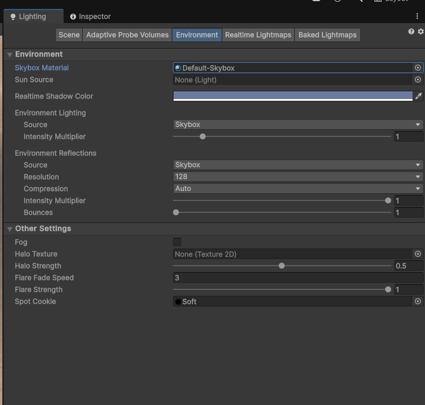
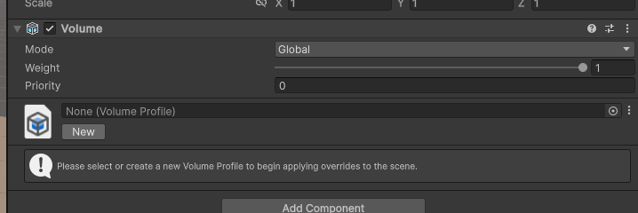

# Laboratorium 5

Temat: Projekty 3D

Cel: Utworzenie projektu w przestrzeni trójwymiarowej; poznanie komponentów Terrain oraz post-processing

Tabela zawartości
---
- [Laboratorium 5](#laboratorium-5)
  - [Tabela zawartości](#tabela-zawartości)
  - [W ramach zajęć](#w-ramach-zajęć)
  - [Tworzenie projektu](#tworzenie-projektu)
  - [Teren](#teren)
  - [Niebo](#niebo)
  - [Postprocessing](#postprocessing)
  - [Dodatkowe źródła assetów](#dodatkowe-źródła-assetów)
    - [Mixamo](#mixamo)
    - [Polyhaven](#polyhaven)

## W ramach zajęć

Należy zapoznać się z treścią konspektu, a następnie przystąpić do wykonywania zadań.

Na ocenę 3

- utworzyć teren z wykorzystaniem komponentu Terrain
  - dodać drzewa, rośliny
  - dodać modele budynków
  - dodać kolizję do obiektów
- dodać niebo (tekstura, lub proceduralne niebo)

Na ocenę 4

zadanie na 3, i dodatkowo:

- korzystając z post-processingu, dodać efekt 'bloom'

Na ocenę 5

zadanie na 4, i dodatkowo:

- dodać na scenę postać gracza
  - postać może się poruszać
  - postać powinna być animowana
    - gdy postać się nie rusza ('idle')
    - gdy postać chodzi
    - gdy postać skacze
    - po kliknięciu (animacja np. uderzenia pięścią)

Rady:
* napisanie własnego kontrolera postaci jest mniej skomplikowane, niż może się to wydawać; płynne przechodzenie między animacjami może jednak sprawić kłopoty, w związku z czym walory wizualne są drugorzędne względem mechanicznego działania
* istnieje możliwość skorzystania z gotowego [pakietu assetów](https://assetstore.unity.com/packages/essentials/starter-assets-thirdperson-updates-in-new-charactercontroller-pa-196526).
  * należy zmienić model postaci oraz animacje, np. korzystając z assetów dostępnych na stronie [mixamo.com](mixamo.com)
  * gotowy kontroler nie ma animacji ataku, a jej dodanie może być bardziej skomplikowane, niż samodzielne napisanie kodu i ustawienie odpowiedniego kontrolera animacji

## Tworzenie projektu

Należy utworzyć nowy, pusty projekt, korzystając z presetu 'Universal 3D'.

Dostępne są dwa presety, które odpowiadają różnym domyślnym ustawieniom graficznym.

URP (Universal Render Pipeline) jest przeznaczony na różne platformy, od urządzeń mobilnych po komputer PC. System grafiki pozwala na dobrą jakość, przy jednocześnie wysokiej wydajności, zoptymalizowanej na różne urządzenia.

HDRP (High Definition Render Pipeline) jest przeznaczony głównie na konsole nowej generacji oraz komputery PC. System grafiki jest bardziej wymagający sprzętowo, przy czym w pełni wspiera ray-tracing oraz global illumination, wolumetryczną mgłę oraz inne efekty graficzne. Nie ma jednocześnie wsparcia na urządzenia mobilne oraz WebGL. W przypadku laboratorium, te możliwości nie są potrzebne.

Nowo utworzony projekt pozwoli na poruszanie się widokiem edytora w trzech wymiarach.

Trzymając prawy przycisk myszy, sterowanie przypomina grę FPP:
* klawisze AWSD pozwalają na ruch do przodu/tyłu/na boki
* klawisze Q oraz E odpowiadają za ruch w górę/w dół
* przytrzymany przycisk shift przyspiesza ruch

Dodatkowo, klikając i trzymając środkowy przycisk myszy, widok można "przeciągać".

## Teren

Aby dodać trójwymiarowy teren, należy wybrać odpowiedni element z rozwijanego menu u góry (`GameObject->3D Object->Terrain`).

Wbudowany moduł terenu działa na zasadzie mapy wysokościowej, tj. nie jest możliwe utworzenie np. tunelu wgłąb terenu, a jedynie podnoszenie i opuszczanie jego wysokości w określonym miejscu. Istnieje natomiast możliwość "wyłączenia" kawałka terenu tak, aby teren nie był tam renderowany oraz aby kolizje tam nie zachodziły.

W inspektorze, na komponencie Terrain, na górze elementu znajduje się 5 przycisków, zmieniających otwarte menu. Są to odpowiednio:
* Dodanie kolejnych kawałków terenu (przy krawędziach istniejącego)
* Edytowanie terenu, w tym zmiana wysokości, edytowanie tekstur
* Dodawanie drzew
* Dodawanie innych detali (kamieni, krzewów, trawy)
* Ustawienia terenu

W przypadku edytowania terennu, bezpośrednio pod przyciskami znajduje się rozwijane menu, służące do wyboru trybu edycji. Mając wybrane odpowiednie narzędzie, wystarczy klikać na teren w widoku edytora, aby zmieniać jego wysokość. Alternatywą dla ręcznego modyfikowania wysokości jest użycie proceduralnie wygenerowanej tekstury.

Opcja narzędzia `Paint Texture` pozwala na malowanie terenu dodanymi teksturami.

W przypadku dodawania nowych warstw, należy wybrać `Edit Terrain Layers...->Add New Layer` i wybrać odpowiednią teksturę.

Ustawienia terenu pozwalają m.in. na zmianę rozdzielczości mapy wysokościowej, jej importowanie i eksportowanie, a także zmianę rozmiaru modelu terenu.

**⚠️ Uwaga: Drzewa to elementy które są dodawane jako prefaby. W związku z tym, jeśli prefab zawiera kolider, to jego instancja dodana jako element terenu również będzie pozwalać na wykrywanie kolizji.**

## Niebo

Okno edytora `Lightning` (`Window->Rendering->Lightning`) pozwala na zmianę ustawień dotyczących m.in. oświetlenia, w tym prerenderowanych map cieni. Zakładka 'Environment' pozwlaa na zmianę materiału nieba.

Aby zmienić niebo na scenie, potrzebny będzie odpowiedni materiał, np. proceduralne niebo oparte o shader, HDRI, lub o skybox (6 tekstur).

## Postprocessing

Postprocessing to zestaw efektów graficznych stosowanych po wyrenderowaniu sceny, czyli bezpośrednio na obrazie (oraz informacjach o wyrenderowanej geometrii), zanim trafi na ekran.

Przykładowe efekty:
* Bloom
* Motion Blur
* Depth of Field
* Ambient Occlusion
* Color Grading
* Vignette
* Chromatic Aberration
* Film Grain

Aby dodać efekty post-process, należy dodać na scenę odpowiedni komponent `Volume`, o ile nie jest już na scenie (`GameObject->Volume->Global Volume`).

Po utworzeniu nowego profilu, lub wybraniu istniejącego, będzie możliwość dodania efektów post-process, wciskając przycisk `Add Override`.

## Dodatkowe źródła assetów

Ze względu na to, jak trudne jest tworzenie animacji dla postaci trójwymiarowych oraz innych zasobów, może istnieć potrzeba, aby znaleść odpowiednie zasoby w Asset Store lub w internecie.

 Należy zwrócić uwagę na fakt, że animacje, o ile są wykonane dla humanoidalnego szkieletu, są interkompatybilne z różnymi modelami i animacjami, również z innych źródeł.

### Mixamo

[Mixamo](https://www.mixamo.com) pozwala na pobranie animacji oraz modeli w formacie przyjaznym dla Unity, lecz wymaga zalogowania się. 

Na górze strony widoczne są dwie zakładki, odpowiednio do pobrania modeli postaci i animacji.

Animacje są interkompatybilne między modelami.

### Polyhaven

Strona [polyhaven.com](https://polyhaven.com) pozwala na pobieranie tekstur (w tym: `bump map`, `normal map`, `specular map`, `mask`, etc.) w większości za darmo.

