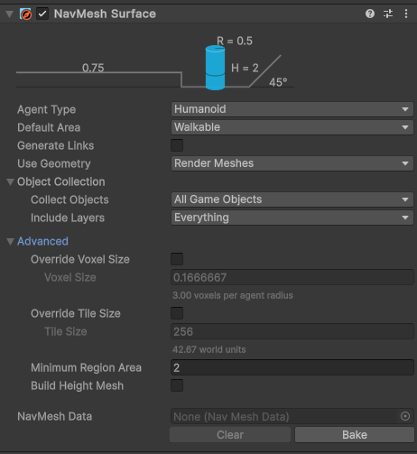
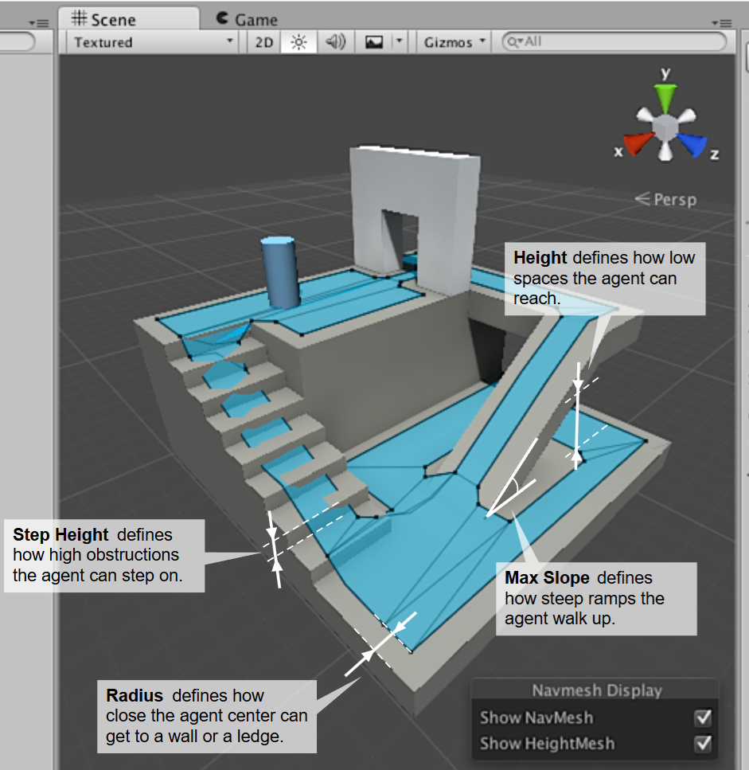
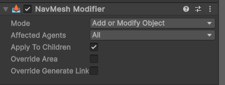
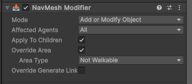
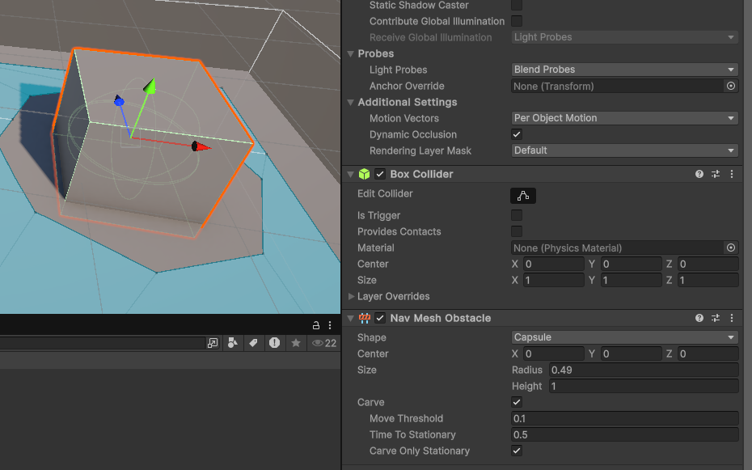
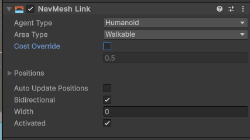
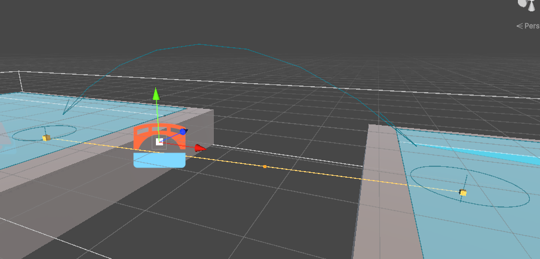
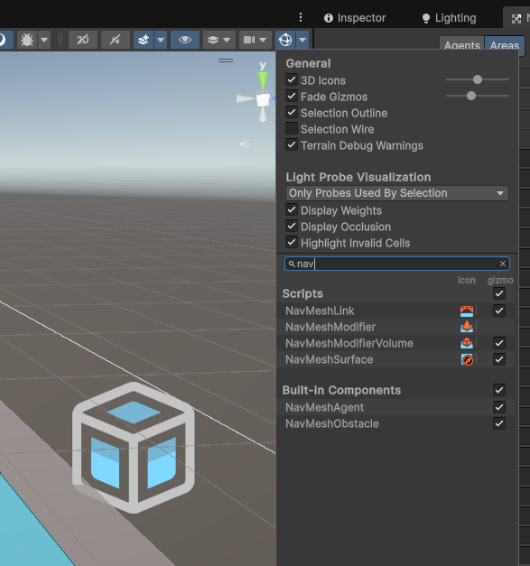
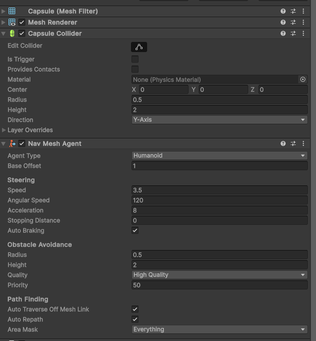

# Laboratorium 6

Temat: Pathfinding, Raycasting

Cel: Poznanie wbudowanego systemu szukania ścieżek, oraz wysyłania promieni przy pomocy systemu fizyki

Tabela zawartości
---
- [Laboratorium 6](#laboratorium-6)
  - [Tabela zawartości](#tabela-zawartości)
  - [W ramach zajęć](#w-ramach-zajęć)
  - [NavMesh](#navmesh)
    - [Baking](#baking)
    - [Używanie nawigacji](#używanie-nawigacji)
  - [Raycasting](#raycasting)

## W ramach zajęć

Należy zapoznać się z treścią konspektu, a następnie przystąpić do wykonywania zadań.

<details>
<summary>Na ocenę 3</summary>

- dodać dwa obiekty: teren, plane, lub inne modele, na których będzie osadzony NavMesh
- na jednym obiekcie ma znajdować się agent, a na drugim cel, do którego agent musi dotrzeć

</details>

<details>
<summary>Na ocenę 4</summary>

zadanie na 3, i dodatkowo:

- dodać obiekt przeciwnika/cel, który może zostać "zastrzelony", po czym zniknie
- po naciśnięciu przycisku myszki ma być wysyłany raycast; jeśli trafi w cel, zostaje uznany za trafiony

</details>

<details>
<summary>Na ocenę 5</summary>

zadanie na 4, i dodatkowo:

- dodać punkty, w których będą pojawiać się przeciwnicy
  - przeciwnicy poruszają się w stronę gracza
  - po dotarciu do gracza znikają
- ustawienia dot. pojawiających się przeciwników (tempo pojawiania się, punkty startowe) powinny być widoczne w inspektorze

</details>

## NavMesh

NavMesh (Navigation Mesh) to system służący do nawigacji AI, który umożliwia agentom poruszanie się po świecie gry w sposób inteligentny, z uwzględnieniem przeszkód i ukształtowania terenu. Pozwala na określanie ścieżki między dwoma punktami w trójwymiarowym środowisku, oraz automatyczną lokomocję obiektów z komponentem typu `NavMesh Agent`.

### Baking

Aby korzystać z nawigacji w Unity, należy najpierw wygenerować 'navMesh'. W tym celu należy dodać obiekt z odpowiednim komponentem na scenę (`GameObject->AI->NavMesh Surface`).

Wygenerowanie faktycznych powierzchni, na których generowane będą ścieżki, można dokonać na dwa sposoby: poprzez interfejs edytora (przycisk Bake), oraz poprzez API. W drugim przypadku pozwala to na generowanie, i regenerowanie modelu np. po proceduralnym utworzeniu mapy.



```csharp
using Unity.AI.Navigation;
using UnityEngine;

public class NavMeshGeneration : MonoBehaviour
{
    [SerializeField]
    private NavMeshSurface navMeshSurface;

    void Start()
    {
        navMeshSurface.BuildNavMesh();
    }
}
```

To, jaką formę przyjmować będzie navmesh, zależy od ustawień komponentu oraz ogólnych ustawień nawigacji dla projektu.



Okno ustawień nawigacji (`Window->AI->Navigation`) pozwala na zmianę ustawień rozmiarów agentów, dla których generowany jest navMesh, oraz określanie rodzajów przestrzeni, po której będą się poruszać. Druga opcja pozwala na określanie, jak bardzo "kosztowny" jest ruch w określonej przestrzeni, w związku z czym algorytm szukania ścieżki będzie preferował możliwie najkrótszą i najtańszą ścieżkę. Specjalnym przypadkiem jest 'Not walkable', która pozwala na określenie powierzchni, po której nie będzie mógł poruszać się agent.

Ustawienia wymiarów agenta to:

* `Radius` - jak blisko krawędzi navMesha może poruszać się agent
* `Step Height` - maksymalna wysokość, na której agent może wchodzić na przeszkody (np. schody)
* `Max Slope` - maksymalne nachylenie terenu, po którym może poruszać się agent
* `Height` - wysokość agenta, ograniczająca przestrzeń ruchu do takej, w której może się zmieścić

Wiele różnych kombinacji wymiarów agentów może współistnieć, a powstały navMesh może być inny dla każdego z nich.

Domyślnie navmesh jest generowany na podstawie graficznych modeli wszystkich obiektów na scenie.

Dla typowego przypadku użycia można zastosować tę kombinację ustawień:

* w komponencie `NavMesh Surface` opcja `Object Collection->Collect Objects` ustawiona na `Nav Mesh Modifier Component Only`, w wyniku czego jedynie obiekty mające komponent `NavMesh Modifier` będą brane pod uwagę przy generowaniu siatki
* obiekty, po których agenci będą mogli się poruszać, mają komponent `NavMesh Modifier`: 
* obiekty, po których agenci nie będą mogli się poruszać i stanowią statyczne przeszkody, również mają ten sam komponent, z ustawieniami zmieniającymi `area`: 
* pozostałe obiekty są ignorowane

Aby utworzyć dynamiczną przeszkodę, która będzie zmieniać navMesh w trakcie działania gry, należy wykorzystać komponent `NavMesh Obstacle`:



Istnieje również możliwość łączenia oddzielnych powierzchni NavMesh z wykorzystaniem komponentu `NavMesh Link`. Pozwala on agentom 'przeskakiwanie' między jego dwoma końcami. Animowanie przeskoków wymaga dodatkowego skryptowania i tworzenia animacji.





Wygenerowany navmesh powinien być widoczny na scenie jako jasnoniebieska, przezroczysta siatka. Jeśli nie jest, należy włączyć jej widoczność w menu widoku edytora:


### Używanie nawigacji

Aby używać systemu nawigacji, można wykorzystać wbudowany komponent `NavMesh Agent`:



Będzie on automatycznie poruszał się w kierunku celu, wzdłuż znalezionej ścieżki, jednocześnie omijając przeszkody. Jeśli cel znajduje się poza zasięgiem, zbliży się do niego tak, jak to możliwe. Wysokość, na której się znajduje również będzie dopasowana do wysokości navMesha w danym punkcie.

Aby określić cel, do którego ma podążać, należy użyć odpowiedniego skryptu:

```csharp
using UnityEngine;
using UnityEngine.AI;

[RequireComponent(typeof(NavMeshAgent))]
public class AgentWalk : MonoBehaviour
{
    [SerializeReference]
    private Transform _target;
    private NavMeshAgent _agent;

    [SerializeReference]
    private float _minDelta = 0.1f;

    void Start()
    {
        _agent = GetComponent<NavMeshAgent>();
    }

    private void Update()
    {
        if(Vector3.Distance(_agent.destination, _target.position) > _minDelta)
        {
            _agent.SetDestination(_target.position);
        }
    }
}
```

Operacje szukania ścieżki są kosztowne, i powinny być w miarę możliwości unikane. Jeśli pozycja docelowa nie zmieniła się znacząco, to ponowne szukanie ścieżki może mieć znikomą wartość.

Dodatkowo, istnieje możliwość generowania ścieżki jako zbioru punktów w celu np. ręcznego animowania ruchu, lub użycia tych danych jako parametru dla animacji opartej o symulacje fizyczne.

```csharp
using UnityEngine;
using UnityEngine.AI;

public class PathSearchExample : MonoBehaviour
{
    [SerializeReference]
    private Transform _target;

    private NavMeshPath _path;

    private void Update()
    {
        if (_path == null)
            _path = new NavMeshPath();

        if (NavMesh.CalculatePath(transform.position, _target.position, NavMesh.AllAreas, _path))
        {
            var corners = _path.corners;
            for (int i = 0; i < corners.Length - 1; i++)
            {
                var p1 = corners[i];
                var p2 = corners[i + 1];

                Debug.DrawLine(p1, p2);
            }
        }
    }
}
```

## Raycasting

Raycast to technika oparta o silnik fizyczny, pozwalająca na znalezienie obiektów, których objętość koliduje z promieniem rzuconym z zadanego punktu i w zadanym kierunku.

Pozwala to na m.in. określenie, jaki jest najbliższy obiekt w danym kierunku, na co jest skierowana kamera (lub na co celuje gracz), nad jakim obiektem aktualnie znajduje się kursor, czy między dwoma obiektami znajdują się jakiekolwiek inne obiekty.

Ze względu na wykorzystywanie silnika fizycznego, wykrywanie kolizji zachodzi z koliderami, a nie wyświetlanymi modelami.

Skrypt określający, na jaki obiekt w przestrzeni trójwymiarowej kliknięto (czyli znajduje się pod kursorem):

```csharp
using UnityEngine;

public class RaycastDemo : MonoBehaviour
{
    private void Update()
    {
        if (Input.GetMouseButton(0))
        {
            Ray ray = Camera.main.ScreenPointToRay(Input.mousePosition);
            // true jeśli cokolwiek zostało trafione
            if (Physics.Raycast(ray, out var hit))
            {
                Debug.Log($"trafiono {hit.transform.name}");
            }
        }
    }
}
```

Dla sytuacji, gdzie promień jest rzucany ze środka kamery i w kierunku patrzenia, kod to:

```csharp
if (Input.GetMouseButton(0))
{
    var pos = Camera.main.transform.position;
    var dir = Camera.main.transform.forward;
    // widoczne w edytorze
    Debug.DrawRay(pos, dir);
    if (Physics.Raycast(pos, dir, out var hit))
    {
        Debug.Log($"trafiono {hit.transform.name}");
    }
}
```

Metoda `RaycastAll` pozwala na zebranie wszystkich obiektów, które przecina rzucany promień. Obie metody mają wiele przeciążeń, pozwalających na określenie:

* punktu początkowego `origin` i kierunku `direction`, lub obu naraz w ramach structa `ray`
* maksymalną długość promienia `maxDistance`, czyli odległość, na której będą wykrywane kolizje; domyślna wartość oznacza nieograniczony dystans
* `layerMask` określający, jakie warstwy (które grupy obiektów) będą wykrywane w ramach kolizji; przydatne, gdy pewne obiekty trzeba wykluczyć, lub brać pod uwagę tylko specyficzną grupę obiektów
* `queryTriggerInteraction` - czy triggery również będą wykrywane
* `out hitInfo` - zawierający informacje o tym, na co trafiono - punkt, w którym trafiono najbliższy obiekt, jaki to obiekt, odległość, na jakiej doszło do trafienia, oraz inne informacje

