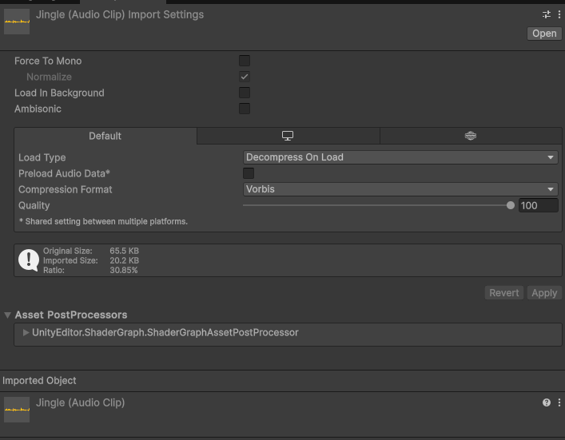
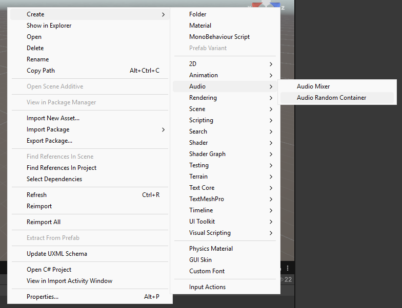
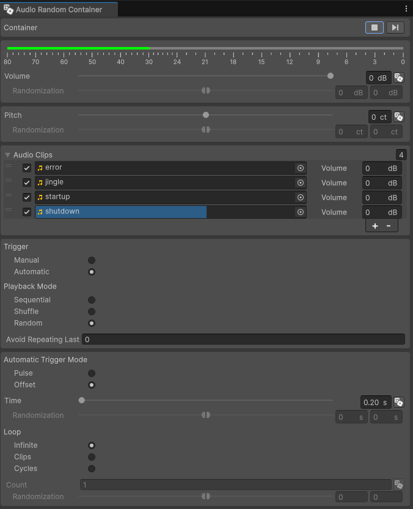
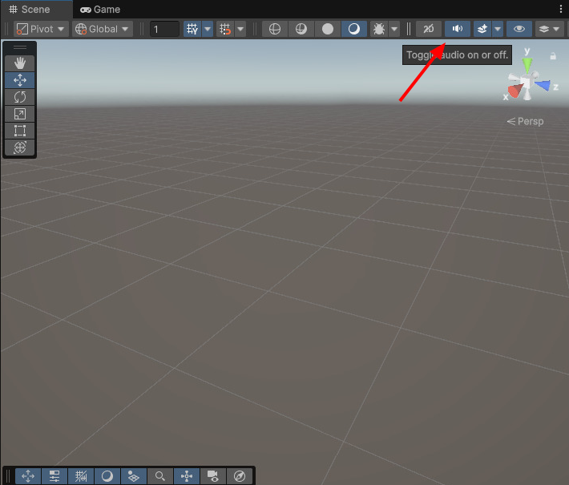
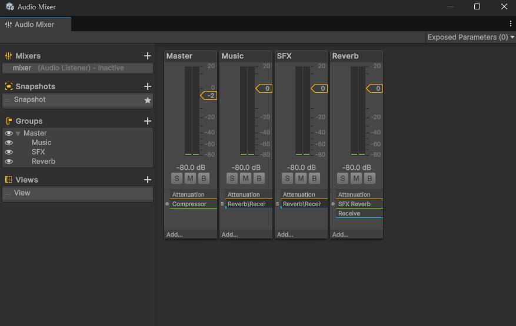
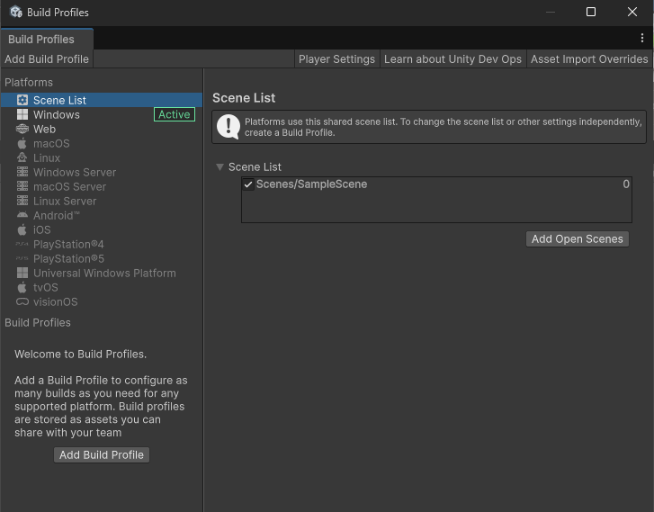
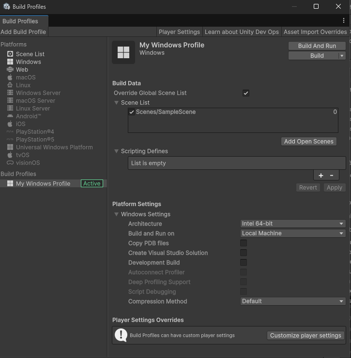
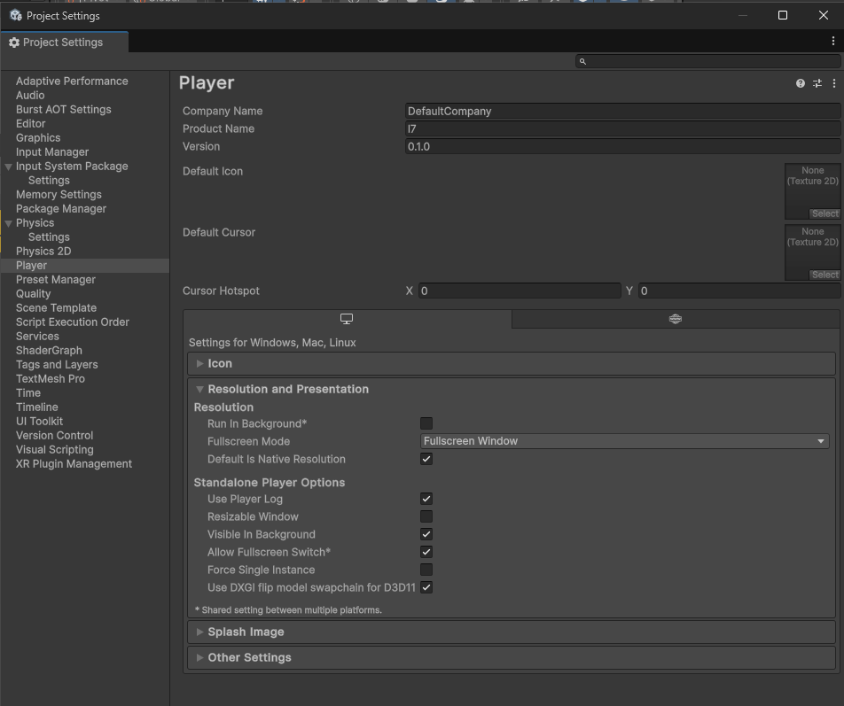
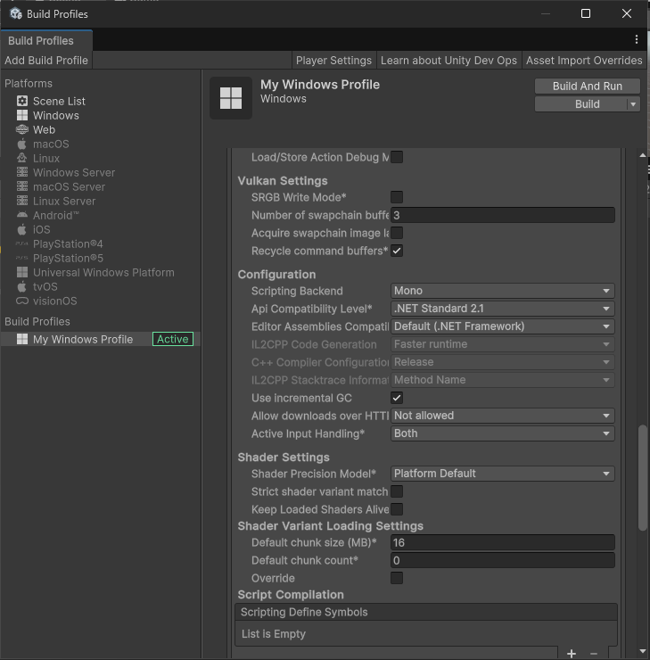

# Laboratorium 7

Temat: Oprawa dźwiękowa, odczyt i zapis danych oraz budowanie projektu

Cel: Poznanie podstawowych metod dodania dźwięków do gry, zapisywanie i odczytywanie danych stanu gry, oraz budowanie projektu

Tabela zawartości
---
- [Laboratorium 7](#laboratorium-7)
  - [Tabela zawartości](#tabela-zawartości)
  - [W ramach zajęć](#w-ramach-zajęć)
  - [Oprawa dźwiękowa](#oprawa-dźwiękowa)
    - [Komponenty i zasoby](#komponenty-i-zasoby)
    - [Mikser](#mikser)
    - [Sterowanie z poziomu kodu](#sterowanie-z-poziomu-kodu)
  - [Zapisywanie i odczytywanie danych](#zapisywanie-i-odczytywanie-danych)
    - [PlayerPrefs](#playerprefs)
    - [JSON](#json)
  - [Kompilacja i budowanie projektu](#kompilacja-i-budowanie-projektu)

## W ramach zajęć

Należy zapoznać się z treścią konspektu, a następnie przystąpić do wykonywania zadań.
Zadania

<details>
<summary>Na ocenę 3</summary>

- dodać muzykę, która będzie grała w tle
  - muzyka składa się z wielu utworów, odtwarzanych w losowej kolejności z tablicy dźwięków, z losowymi, sparametryzowanymi odstępami między końcem i początkiem kolejnych utworów

</details>

<details>
<summary>Na ocenę 4</summary>

zadanie na 3, i dodatkowo:

- dodać tekst nad głową gracza, zawierający jego imię
  - po włączeniu gry, na ekranie powinno pojawić się pole do wprowadzenia imienia gracza
  - po zatwierdzeniu (poprzez wciśnięcie przycisku) pojawia się nad jego głową
  - imię jest domyślnie ustawione na to, które zostało poprzednio wprowadzone
    - imię gracza jest zapisywane do `PlayerPrefs` po zaakceptowaniu, oraz odczytywane (o ile istnieje) przy uruchomieniu gry
  - ustawienie imienia gracza może odbywać się poprzez osobne menu

</details>

<details>
<summary>Na ocenę 5</summary>

zadanie na 4, i dodatkowo:

- utworzyć `slider`, który steruje głośnością muzyki
  - ustawiona wartość jest zapisywana do `PlayerPrefs` i przywracana po ponownym uruchomieniu gry
- dodać przycisk do całkowitego wyciszenia muzyki
  - ustawiona opcja jest zapisywana do `PlayerPrefs` i przywracana po ponownym uruchomieniu gry

</details>

## Oprawa dźwiękowa

Dźwięk, w tym muzyka, służy do m.in. budowania atmosfery i immersji oraz wzmacniania emocji.

System audio w Unity umożliwia użycie efektów przestrzennych takich jak pogłos i efekt Dopplera. Pozwala również na zaawansowane miksowanie dźwięków, wykorzystywanie efektów i filtrów.

### Komponenty i zasoby

`AudioClip` to zasób odpowiadający plikom audio. Wspierane rozszerzenia to `.wav`, `.mp3`, `.ogg`, `.flac`, `.aiff/aif`.



* Force To Mono - wielokanałowe audio zostanie miksowane do jednego kanału, co zmniejszy użycie pamięci; jednokanałowe audio jest typowo używane dla dźwięków punktowych
  * Normalize - czy audio będzie znormalizowane po zmiksowaniu do jednego kanału
* Load in Background - czy audio może być ładowane w tle, dzięki czemu ładowanie nie będzie blokować głównego wątku i zatrzymywać aplikacjii, jednocześnie pozwalając na opóźnienie między porządanym rozpoczęciem odtwarzania i faktycznym odtwarzaniem dźwięku
* Ambisonic - specjalne ustawienie określające, czy dźwięk to specjalny, wielokanałowy plik typu ambisonic (używane m.in. dla VR)

`AudioListener` to komponent, który odbiera dźwięki. Typowo na scenie powinien istnieć tylko jeden włączony komponent tego typu, i znajdować się na aktywnej, głównej kamerze. Nie ma on żadnych własnych ustawień.

`AudioSource` to komponent, który odtwarza dźwięki. Ustawienia komponentu pozwalają na kontrolę nad efektami przestrzennymi, zmianę wysokości i głośności dźwięku, oraz tego, czy dźwięk jest automatycznie zapętlony oraz czy jest uruchamiany automatycznie.


Istnieją również komponenty odpowiadające różnym rodzajom filtrów dźwięku: `Audio Chorus Filter`, `Audio Distortion Filter`, `Audio Echo Filter`, `Audio Highpass Filter`, `Audio Lowpass Filter`. Mogą być one przypięte na obiekcie, na którym znajduje się już `AudioSource`, aby mieć wpływ na odtwarzany dźwięk, lub na obiekcie, na którym znajduje się `AudioListener`, przez co efekt będzie miał wpływ na wszystkie słyszane dźwięki.

Zasób `Audio Random Container` pozwala na odtwarzanie dźwięków z określonymi ustawieniami z ustawionego zakresu plików. Umożliwia to na uruchamianie dźwięków w kolejności lub losowo. Obiekt można utworzyć poprzez menu pod prawym przyciskiem myszy, lub rozwijane menu: `Assets->Create->Audio->Audio Random Container`. Zasób ten można wykorzystać zamiast `AudioClip` w `AudioSource`.





Istnieje możliwość włączenia dźwięku w widoku edytora, co pozwoli na podgląd oprawy audio bez uruchamiania trybu gry. Opcja dostępna jest pod przyciskiem w prawym górnym rogu okna `Scene`, z ikoną (przekreślonego) głośnika:



### Mikser

Mikser audio pozwala na tworzenie łańcuchów filtrów i miksowania audio, umożliwiając zaawansowane dostrojenie oprawy dźwiękowej. Swoją formą może przypominać animator, również ze względu na możliwość sterowania parametrami z poziomu kodu w bardzo podobny sposób.



Ze względu na złożoność, wykorzystanie go jest niepraktyczne w ramach tego laboratorium, natomiast w rzeczywistych projektach może być przydatny.

### Sterowanie z poziomu kodu

Standardowe właściwości poszczególnych komponentów dostępne są z poziomu kodu, na przykład głośność:

```csharp
using UnityEngine;

public class Example : MonoBehaviour
{
    [SerializeReference]
    private AudioSource _audioSource;

    void Update()
    {
        _audioSource.volume = 0.5f + Mathf.Sin(Time.time) * 0.5f;
    }
}
```

Uruchamianie i zatrzymywanie dźwięku:

```csharp
using System.Collections;
using UnityEngine;

public class Example : MonoBehaviour
{
    [SerializeReference]
    private AudioSource _audioSource;

    void Start()
    {
        _audioSource.Play();
        StartCoroutine(Stop());
    }

    IEnumerator Stop()
    {
        yield return new WaitForSeconds(1f);
        _audioSource.Stop();
    }
}
```

Odtwarzanie dźwięku w określonym punkcie (aby uniknąć potrzeby tworzenia nowego źródła dla każdego odtworzenia):

```csharp
using UnityEngine;

public class Example : MonoBehaviour
{
    [SerializeReference]
    private AudioClip _audioClip;

    void Start()
    {
        AudioSource.PlayClipAtPoint(_audioClip, new Vector3(5, 1, 2));
    }
}
```

## Zapisywanie i odczytywanie danych

Możliwość zapisu informacji takich jak ustawienia, preferencje użytkownika, stan gry jest możliwa na wiele sposobów, z różnymi stopniami złożoności w zależności od potrzeby.

Zapisywanie stanu gry to złożony problem, i złożoność rozwiązania zależy od danych, na jakich operuje gra. Dwa rozwiązania są często wystarczające: `PlayerPrefs` oraz serializacja danych i zapisywanie ich w formacie JSON jako plik.

### PlayerPrefs

W przypadku najprostszych, małych ustawień, skuteczne będzie wykorzystanie `PlayerPrefs`. Dane nie są szyfrowane, ani w jakikolwiek sposób zabezpieczone, a ich miejsce zapisu zależy od platformy. W przypadku systemu Windows, dane będą znajdować się w rejestrze systemu.

Zapisywanie i odczytywanie danych jest relatywnie proste:
```csharp
using UnityEngine;

public class Example : MonoBehaviour
{
    [SerializeField]
    private int _score;
    [SerializeField]
    private float _volume;
    [SerializeField]
    private string _name;

    void Start()
    {
        _score = PlayerPrefs.GetInt("HighScore", _score);
        _volume = PlayerPrefs.GetFloat("Volume", _volume);
        _name = PlayerPrefs.GetString("PlayerName", _name);
    }

    void OnDestroy()
    {
        PlayerPrefs.SetInt("HighScore", _score);
        PlayerPrefs.SetFloat("Volume", _volume);
        PlayerPrefs.SetString("PlayerName", _name);
        PlayerPrefs.Save(); // wykonuje zapis natychmiast; domyślnie zapis jest wykonywany przy zamykaniu aplikacji
    }
}
```

Dane można również usunąć:
```csharp
PlayerPrefs.DeleteKey("Volume");
PlayerPrefs.DeleteAll();
```

### JSON

Dane mogą zostać serializowane do formatu JSON, i zapisywane jako plik. Umożliwia to wykorzystanie złożonych struktur, aby reprezentować skomplikowane dane gry. Plik można również szyfrować i deszyfrować, lecz nie jest to dobre zabezpieczenie.

Na przykład:
```csharp
using System.IO;
using UnityEngine;

[System.Serializable]
public class State
{
    public int Score;
    public float Volume;
    public string Name;
}

public class Example : MonoBehaviour
{
    [SerializeField]
    private State state;

    private string Path => Application.persistentDataPath + "/playerdata.json";

    void Start()
    {
        if (File.Exists(Path))
        {
            var json = File.ReadAllText(Path);
            state = JsonUtility.FromJson<State>(json);
        }
        else
        {
            state = new State();
        }
    }

    void OnDestroy()
    {
        string json = JsonUtility.ToJson(state);
        File.WriteAllText(Path, json);
    }
}
```

## Kompilacja i budowanie projektu

Aby móc dystrybuować grę, należy ją zbudować do formy wykonywalnej na docelowych platformach.

Należy otworzyć okno poprzez rozwijane menu: `File->Build Profiles`.

W zależności od platformy, gra może przebiegać lub rozpoczynać się od innej sceny, aby uwzględnić różne potrzeby różnych platform. Z tego względu okno pozwala na ustawienie scen współdzielonych między platformami, oraz dla każdej z platform osobno, po utworzeniu osobnego profilu:





Wciśnięcie przycisku `Player settings` na belce tego okna, lub otwarcie okna przez rozwijane menu `Edit->Project Settings` i wybranie `Player` z kolumny po lewej, otworzy widok z ustawieniami wybudowanego projektu. Pozwoli to na ustawienie m.in. ikony projektu, jego nazwy, wersji, organizacji, oraz ustawienia specyficzne dla poszczególnych platform.

W zależności od platformy, Unity pozwala na konfigurację zaawansowanych ustawień projektu, takich jak sterownik wykorzystywany przez grafikę (OpenGL/DirectX), wersja back-endu skryptów (np. kompilowanie skryptów do C++, albo wykorzystanie .NET Standard lub .NET Framework), oraz logo wyświetlane po uruchomieniu gry.



Ustawienia te mogą być także nadpisane przez profil. Tego typu konfiguracja wspomaga np. automatyczne budowanie wielu wersji gry w zależności od platformy i ustawień, aby móc m.in. automatycznie porównywać szybkość programu w zależności od parametrów.



Upraszczając, dodatkowe ustawienia konfiguracji, jakie mogą być przydatne w pierwszej kolejności to:

* rozdzielczość, rozmiar i rodzaj okna, w jakim gra się uruchamia
* możliwość pracy gry w tle
* dodatkowe możliwości optymalizacji (pregenerowane kolidery, upraszczane modele, kompresja tekstur i modeli)
* ustawienia ikony programu (pierwsze wrażenie jest ważne)
