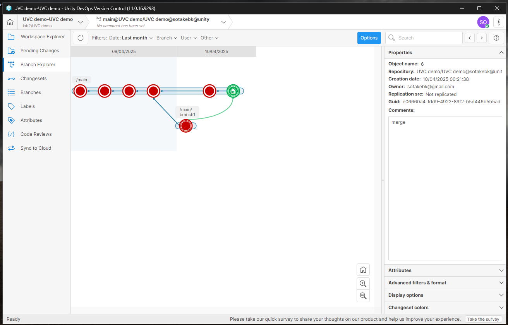

# Dodatek: Wersjonowanie projektu

Temat: Wersjonowanie projektu

Cel: Poznanie systemu Unity Version Control

Tabela zawartości
---
- [Dodatek: Wersjonowanie projektu](#dodatek-wersjonowanie-projektu)
  - [Tabela zawartości](#tabela-zawartości)
  - [Unity Version Control](#unity-version-control)
    - [Włączenie](#włączenie)
    - [Używanie](#używanie)
      - [Dodawanie użytkowników](#dodawanie-użytkowników)
      - [Wprowadzanie zmian](#wprowadzanie-zmian)
    - [Unity DevOps Version Control](#unity-devops-version-control)
    - [Znane problemy](#znane-problemy)

## Unity Version Control

Unity Version Control (wcześniej znany jako Plastic SCM) to system kontroli wersji zaprojektowany specjalnie z myślą o potrzebach zespołów tworzących gry i inne projekty w Unity. Jest alternatywą dla Git, który gorzej radzi sobie z plikami binarnymi oraz dużymi plikami, o ile nie używa się Git LFS.

Używanie Unity Version Control jest bardzo podobne do Git, z podobnymi nazwami na analogiczne elementy: `changeset` zamiast `commit`, `branch`, `merge`, itd.

Należy mieć na uwadze, że on-prem, tzn. własne hostowanie serwera hostującego kod źródłowy, wymaga zakupu odpowiedniej wersji na specjalnej licencji. Kolejnym ograniczeniem jest limit przestrzeni dyskowej przeznaczonej na pliki projektu, który wynosi 10 GB dla całej 'organizacji'.

Interfejs edytora jest dość nieprzystępny na moment pisania tego konspektu. [Dedykowany klient](https://docs.unity.com/ugs/en-us/manual/devops/manual/version-control-desktop-client) jest znacznie wygodniejszy, przystępniejszy, oraz pozwala na wykonywanie wielu operacji które są niedostępne, lub trudne do odnalezienia w interfejsie edytora.

### Włączenie

Włączenie UVC wymaga integracji z usługami chmurowymi. Nowo tworzony projekt można odpowiednio ustawić tak, aby został automatycznie powiązany z odpowiednim zasobem chmurowym, lub istniejący już projekt może zostać zarejestrowany.

Aby zarejestrować istniejący projekt, należy otworzyć odpowiednie okno poprzez rozwijane menu (`Window->Unity Version Control`).

Na stronie [https://cloud.unity.com/home/](https://cloud.unity.com/home/) powinna pojawić się zakładka z nowo dodanym projektem.

### Używanie

#### Dodawanie użytkowników

Aby móc pracować nad jednym projektem z wieloma osobami, należy dodać je do organizacji, lub zaprosić do projektu.

Dodany użytkownik powinien móc dodać projekt z repozytorium poprzez program Unity Hub:

#### Wprowadzanie zmian

Po wprowadzeniu jakichkolwiek zmian w projekcie, lista oczekujących zmian (`Pending Changes`) będzie zawierać informacje o tym jaki plik został dodany, usunięty, lub zmodyfikowany. Można również podejrzeć zmiany w plikach testowych, i porównać z poprzednią wersją.

`Changesets` zawiera historię zmian.

W typowej pracy, każda osoba ma własną gałąź, na której pracuje nad osobnym, możliwie niezależnym elementem. W innym wypadku zmiany wprowadzane na jednej gałęzi mogą potencjalnie powodować problemy z ciągłymi konfliktami, złe zmiany są problematyczne w cofaniu, itp. tak, jak używając git.

Gałęzie można utworzyć w sposób zaprezentowany poniżej.

Lokalny projekt można przełączać między gałęziami za pomocą opcji `Switch workspace to this branch`.

Po wykonaniu swoich zmian, gałąź można scalić `merge` do 'głównej' gałęzi. W tym celu należy przełączyć się na gałąź docelową, i wybrać `merge from this branch...` na drugiej gałęzi.

W przypadku konfliktów, czyli różnych zmian w tych samych plikach, scalanie wymaga ręcznego zmodyfikowania kodu i zaakceptowania wynikających zmina.

### Unity DevOps Version Control

Unity ma również [dedykowane narzędzie dla obsługi systemu wersjonowania](https://docs.unity.com/ugs/en-us/manual/devops/manual/version-control-desktop-client) analogiczne do np. SourceTree dla `git`. Ma ono znacznie bardziej przystępny interfejs użytkownika, oraz pozwala na lepszą wizualizacje zmian, oraz natywne rozwiązywanie konfliktów.

Interfejs pozwala również na wiele więcej operacji, wiele z nich nie jest dostępne w interfejsie edytora. Wszystko, co można zrobić w edytorze, działa analogicznie w tym interfejsie.

### Znane problemy

W razie wystąpienia poniższego błędu, zwykłe zamknięcie i ponowne otwarcie projektu może pomóc. W innym przypadku, informacje dostępne w internecie mogą pomóc.

